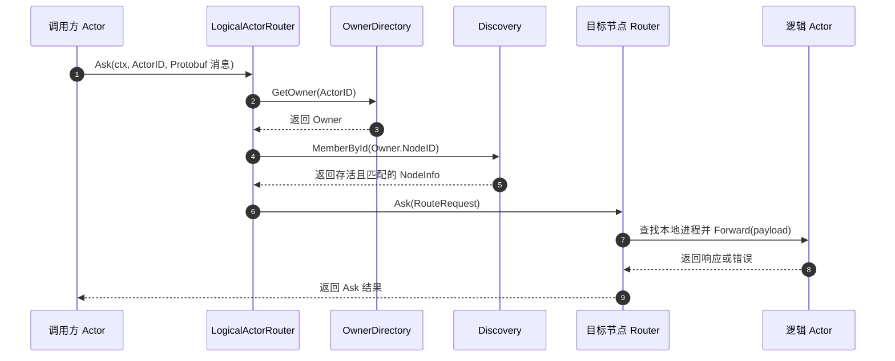
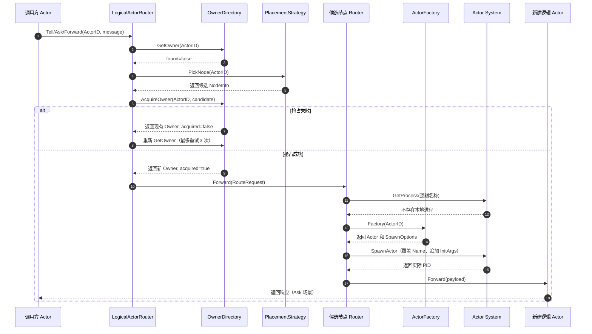
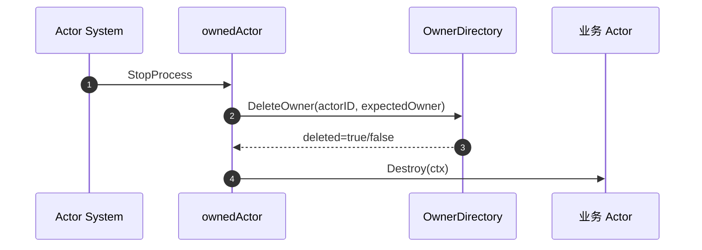

# Logical Actor 逻辑 Actor 手册

`framework/logicalactor` 在普通 Actor 之上增加稳定的逻辑身份和跨节点路由。业务只需要使用 `ActorID{Kind, Key}`，不需要预先知道实际进程 PID 或 Owner 节点。

## 核心概念

| 概念 | 说明 |
| --- | --- |
| `ActorID` | 逻辑 Actor 身份，由 Kind 和 Key 组成，例如 `player:1001` |
| `NodeInfo` | Owner 节点信息，包含 NodeID、服务 Kind 和 InstanceID |
| `OwnerDirectory` | 保存逻辑 Actor 到 Owner 节点映射的接口 |
| `PlacementStrategy` | 没有 Owner 时选择候选节点的策略 |
| `ActorFactory` | Owner 节点按 Kind 创建实际 Actor 的工厂 |
| `Router` | 每个节点上的内部 Actor，负责本地激活、转发和关闭 |

ActorID 的格式化结果：`player:1001`，实际 Actor 名称为 `$logical:player:1001`。Kind 和 Key 不能为空，也不能包含冒号。

## 路由架构

```text
业务 Actor.Context -> LogicalActorRouter -> OwnerDirectory/Discovery/Placement
                                      -> 目标节点的 $logical-router
                                      -> 本地查找或 Factory 激活 -> Forward
```

路由请求使用 `logicalactor/pb.RouteRequest`，业务 Protobuf 消息放在 `google.protobuf.Any` 中。跨节点转发最多增加 3 次 `ForwardCount`，超过限制返回 `ErrRouteForwardLimit`。

## 初始化顺序

Router 依赖已经启动的 Actor System、Owner Directory 和 Discovery：

```go
router := logicalactor.New(local, system, discovery)
router.SetDirectory(directory)
if err := router.RegisterFactory("player", factory); err != nil { return err }
strategy, err := placement.NewDynamicRoundRobinStrategy(discovery)
if err != nil { return err }
if err := router.RegisterPlacement("player", strategy); err != nil { return err }
if err := router.Start(); err != nil { return err }
```

`logicalactor.New` 返回 `ActorRouter` 接口。`SetDirectory` 没有返回值，应在 `Start` 前调用。当前 Router 通过 `BaseComponent` 管理生命周期，调用方需要先完成 Node 的 `Init` 阶段，再调用 `Start`。`Start` 会检查 Actor System、Owner Directory、Discovery 以及内部 `$logical-router` Actor 是否可创建。

在 `node.Node` 中，如果提供 `Options.LogicalActorDirectory` 且没有注入自定义 Router，Node 会自动创建 Logical Actor Router，并在组件启动阶段启动它。业务通常在 `NodeBehavior.OnStart` 中注册 Factory 和 Placement。

## Factory 和 Placement

```go
router.RegisterFactory("player", func(id logicalactor.ActorID) (actor.Actor, actor.SpawnOptions) {
    return &PlayerActor{}, actor.SpawnOptions{MailboxSize: 2048}
})
strategy, err := placement.NewDynamicRoundRobinStrategy(discovery)
if err != nil { return err }
if err := router.RegisterPlacement("player", strategy); err != nil { return err }
```

Factory 不能为 nil，同一个 Kind 只能注册一次；Factory 返回 nil Actor 时返回 `ErrActorFactoryReturnedNil`。Router 会覆盖 `SpawnOptions.Name` 为逻辑名称，并把 ActorID 追加到 `InitArgs`。

动态 Round Robin 通过 `NodeProvider.Members(kind)` 读取节点，按 NodeID 排序，再使用进程内原子计数器轮询。Provider 为 nil 时 `PickNode` 返回 `ErrNodeProviderNil`，没有节点时返回 `ErrNoAvailableNodes`。

```go
type NodeProvider interface {
    Members(service string) map[string]logicalactor.NodeInfo
}
```

## Tell、Ask 和 Forward

```go
Tell(ctx actor.Context, actorID ActorID, message proto.Message) error
Ask(ctx actor.Context, actorID ActorID, message proto.Message) (any, error)
Forward(ctx actor.Context, actorID ActorID, message proto.Message) error
```

- `Tell`：异步投递，不等待响应。
- `Ask`：等待响应或超时。
- `Forward`：保留当前 Actor 消息的 Sender 和请求元数据。
- `ctx == nil` 返回 `ErrActorContextNil`。
- 无效 Protobuf 消息由 Protobuf 编解码器返回错误。
- Router 未启动时返回 `ErrLogicalActorRouterNotStarted`。

## Owner 解析和激活

1. `GetOwner` 查询目录。
2. 通过 `Discovery.MemberById` 检查 Owner 节点是否仍存活。
3. Owner 失效时尝试 `DeleteOwner`。
4. 无 Owner 时使用对应 Kind 的 Placement Strategy。
5. 调用 `AcquireOwner` 原子抢占，最多尝试 3 次。
6. 目标节点 Router 查找本地进程；不存在则 Factory 激活并转发首条消息。

当前最多尝试 3 次；耗尽后返回最后一次 Owner 解析错误。节点存活检查比较 Discovery 返回的完整 `NodeInfo`（包括 `instance_id`），而 Router 判断消息是否应在本机处理只比较 `NodeId`。这依赖部署约束：同一时间不存在多个相同 `node_id` 的进程。

## Actor 停止与 Owner 清理

当前 `ActorRouter` 接口没有导出的 `CloseActor` 方法，源码中与之对应的实现仍处于注释状态，因此业务代码不能依赖 `router.CloseActor(...)`。

逻辑 Actor 的正常清理由包装器 `ownedActor.Destroy` 完成：Actor 进程停止时，它使用创建该实例时记录的 Owner 调用 `OwnerDirectory.DeleteOwner`，然后再调用业务 Actor 的 `Destroy`。删除操作是条件删除，只有目录中的 `node_id` 和 `instance_id` 都与 expected owner 相同才会删除；因此旧实例不能删除新实例的 Owner。若进程异常退出，目录没有 TTL，后续路由会通过 Discovery 判断 Owner 是否存活并尝试清理。

## Redis Owner Directory

```go
directory, err := directory.NewRedisDirectory(redisClient, directory.RedisOwnerDirectoryOptions{KeyPrefix: "owner."})
if err != nil { return err }
defer directory.Close()
```

Key 当前生成格式为 `{directory}.<KeyPrefix><actorID>` 和 `{directory}.<KeyPrefix><actorID>.epoch`；即使 `KeyPrefix` 为空也保留 `{directory}.` 前缀，Owner Key 与 Epoch Key 因此处于同一 Redis Cluster hash slot。两个 Key 由同一个 Lua 脚本同时访问。`GetOwner` 先查本地缓存，缓存未命中再执行 Lua 查询；`AcquireOwner` 使用 Lua 原子抢占；`DeleteOwner` 要求 `node_id` 和 `instance_id` 同时匹配；Owner 变化通过 Pub/Sub 通知其他实例清理缓存。

当前限制：Owner 记录没有 TTL、租约、fencing token 或 epoch 自动过期机制。节点异常退出后，失效 Owner 依赖路由器发现节点不存活并执行 `DeleteOwner`。Redis 客户端为 nil 时返回 `ErrRedisClientNil`。

## API 参考

| API | 说明 |
| --- | --- |
| `New(local, actorSystem, discovery) ActorRouter` | 创建 Router |
| `(*Router).SetDirectory` | 注入 Owner Directory |
| `(*Router).Start/Stop` | 启停内部 Router Actor |
| `RegisterFactory` / `RegisterPlacement` | 注册 Factory 和 Placement |
| `Tell` / `Ask` / `Forward` | 逻辑消息路由 |
| `ActorID.Validate/String/Name` | 校验和格式化逻辑 ID |
| `NodeInfo.Validate` | 校验节点信息 |
| `NewRedisDirectory` | 创建 Redis Owner Directory |
| `GetOwner` / `AcquireOwner` / `DeleteOwner` | 查询、抢占和删除 Owner |
| `RedisOwnerDirectory.Close` | 关闭 Pub/Sub 订阅 |
| `NewDynamicRoundRobinStrategy` | 创建动态轮询策略 |
| `RoundRobinStrategy.PickNode` | 选择节点 |

## 常见错误

`ErrActorSystemNil`、`ErrOwnerDirectoryNil`、`ErrDiscoveryNil` 表示启动依赖缺失；`ErrFactoryNotFound`、`ErrPlacementStrategyNotFound` 表示 Kind 未注册；`ErrRouteForwardLimit` 和 `ErrNoAvailableNodes` 分别表示转发次数和节点可用性问题。`ErrOwnerMismatch` 仍是包中的导出错误值，但当前 `ActorRouter` 没有使用它的 Close API。

## 时序图

以下时序图对应当前源码中的 `LogicalActorRouter`、内部 `$logical-router` Actor、`OwnerDirectory`、`Discovery` 和 `ActorFactory` 调用关系。

### 1. 已有 Owner 的 Ask 路由



如果 `Owner.NodeID` 是当前节点，`RR` 是本地 `$logical-router`；如果是其他节点，Actor System 会通过远程 Actor 消息发送 `RouteRequest`。

### 2. 首次访问的 Owner 抢占与 Actor 激活



如果候选 Owner 实际落在其他节点，目标 Router 会增加 `ForwardCount` 并继续转发；超过 3 次返回 `ErrRouteForwardLimit`。

### 3. Actor 停止时的 Owner 清理



这是进程停止时的内部清理流程，不是一个可由 `ActorRouter` 调用的 Close API。`DeleteOwner` 的比较规则是完整 Owner：`node_id + instance_id`；抢占是否成功则由 `AcquireOwner` 的 `acquired` 布尔值表示，不能把 `instance_id` 当作路由节点 ID 使用。
