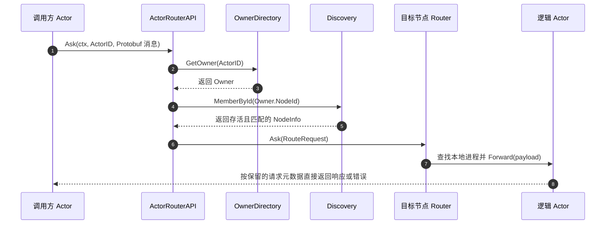
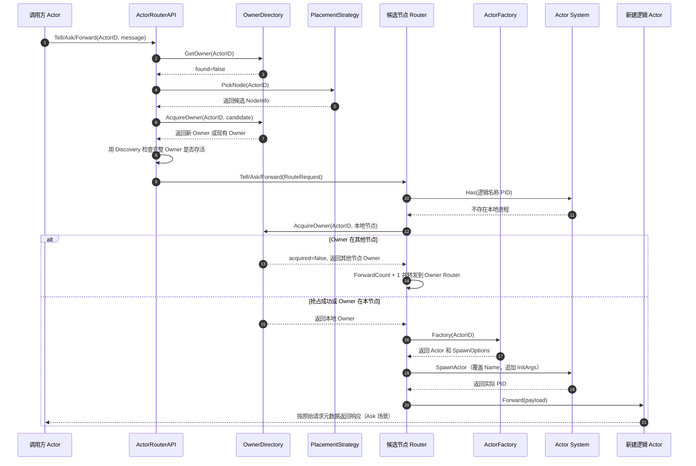
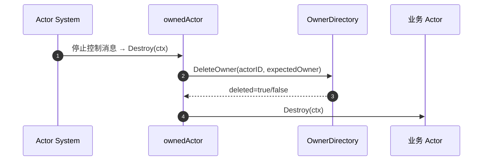

# Logical Actor 逻辑 Actor 手册

`github.com/dzm2020/actormesh/logicalactor` 在普通 Actor 之上增加稳定的逻辑身份和跨节点路由。业务只需要使用 `ActorID{Kind, Key}`，不需要预先知道实际进程 PID 或 Owner 节点。

## 核心概念

| 概念 | 说明 |
| --- | --- |
| `ActorID` | 逻辑 Actor 身份，由 Kind 和 Key 组成，例如 `player:1001` |
| `NodeInfo` | Owner 节点信息，字段为 `NodeId`、服务 `Kind` 和 `InstanceId` |
| `OwnerDirectory` | 保存逻辑 Actor 到 Owner 节点映射的接口 |
| `PlacementStrategy` | 没有 Owner 时选择候选节点的策略 |
| `ActorFactory` | Owner 节点按 Kind 创建实际 Actor 的工厂 |
| `Router` | 每个节点上的内部 Actor，负责本地激活、转发和关闭 |

ActorID 的格式化结果：`player:1001`，实际 Actor 名称为 `$logical:player:1001`。Kind 和 Key 不能为空，也不能包含冒号。

## 路由架构

```text
业务 Actor.Context -> ActorRouterAPI -> OwnerDirectory/Discovery/Placement
                                      -> 目标节点的 $logical-router
                                      -> 本地查找或 Factory 激活 -> Forward
```

路由请求使用 `logicalactor/pb.RouteRequest`，业务 Protobuf 消息放在 `google.protobuf.Any` 中。内部 Router 收到 `ForwardCount >= 3` 的请求即返回 `ErrRouteForwardLimit`。

## 初始化顺序

独立使用时，先准备 Actor System、Owner Directory 和 Discovery，再初始化并启动 Router：

```go
router := logicalactor.New(logicalactor.Options{
    Local: local, System: system, Discovery: discovery,
})
router.SetDirectory(directory)
if err := router.RegisterFactory("player", factory); err != nil { return err }
strategy, err := placement.NewDynamicRoundRobinStrategy(discovery)
if err != nil { return err }
if err := router.RegisterPlacement("player", strategy); err != nil { return err }
if err := router.Init(); err != nil { return err }
if err := router.Start(); err != nil { return err }
```

`logicalactor.New` 返回 `ActorRouterAPI` 接口。`SetDirectory` 没有返回值，应在 `Start` 前调用。当前 Router 通过 `BaseComponent` 管理生命周期，独立使用时先调用 Router 的 `Init`，再调用 `Start`；Node 托管时由组件管理器执行这两个阶段。`Start` 会检查 Actor System、Owner Directory、Discovery 以及内部 `$logical-router` Actor 是否可创建。

在 `node.Node` 中，未注入 `Options.ActorRouter` 时会自动创建 Router，并在组件阶段依次初始化、启动它。`node.Options` 没有 Directory 字段，业务需要在 `NodeBehavior.OnInit` 或 `OnStart` 中通过 `node.GetActorRouter().SetDirectory(directory)` 注入目录，并注册 Factory 和 Placement；未注入目录时 Router 启动失败。

## Factory 和 Placement

```go
router.RegisterFactory("player", func(id logicalactor.ActorID) (actor.Actor, actor.SpawnOptions) {
    return &PlayerActor{}, actor.SpawnOptions{MailboxSize: 2048}
})
strategy, err := placement.NewDynamicRoundRobinStrategy(discovery)
if err != nil { return err }
if err := router.RegisterPlacement("player", strategy); err != nil { return err }
```

Factory 不能为 nil，同一个 Kind 只能注册一次；Factory 返回 nil Actor 时返回 `ErrActorFactoryReturnedNil`。Router 会覆盖 `SpawnOptions.Name` 为逻辑名称，并把 ActorID 追加到 `InitArgs`。

动态 Round Robin 通过 `NodeProvider.Members(kind)` 读取节点，按 `NodeId` 排序，再使用每个策略实例内的原子计数器轮询。Provider 为 nil 时 `PickNode` 返回 `ErrNodeProviderNil`，没有节点时返回 `ErrNoAvailableNodes`。

```go
type NodeProvider interface {
    Members(service string) map[string]logicalactor.NodeInfo
}
```

## Tell、Ask 和 Forward

```go
Tell(ctx actor.Context, actorID ActorID, message proto.Message) error
Ask(ctx actor.Context, actorID ActorID, message proto.Message) (any, error)
Forward(ctx actor.Context, actorID ActorID, message proto.Message) error
```

- `Tell`：异步投递，不等待响应。
- `Ask`：等待响应或超时。
- `Forward`：保留当前 Actor 消息的 Sender 和请求元数据。
- `ctx == nil` 返回 `ErrActorContextNil`。
- 无效 Protobuf 消息由 Protobuf 编解码器返回错误。
- Router 未启动时返回 `ErrLogicalActorRouterNotStarted`。

## Owner 解析和激活

1. `GetOwner` 查询目录。
2. 没有 Owner 时使用该 Kind 的 Placement Strategy，并调用 `AcquireOwner`；这里直接使用返回的 Owner，不依据 `acquired` 决定重试。
3. 通过 `Discovery.MemberById` 比较返回的完整 `NodeInfo`，检查 Owner 是否存活。
4. Owner 失效时尝试 `DeleteOwner` 后重试；查询、选点和抢占出错时也重试。整个解析循环最多 3 次。
5. 目标 Router 先按逻辑名称检查本地进程；存在则直接转发，不再查询目录。
6. 本地进程不存在时再次 `AcquireOwner`。其他节点持有 Owner 时递增 `ForwardCount` 并转发；Owner 在本节点或抢占成功时通过 Factory 激活，并转发首条消息。激活失败时尝试条件删除 Owner。
当前最多尝试 3 次；耗尽后返回最后一次 Owner 解析错误。节点存活检查比较 Discovery 返回的完整 `NodeInfo`（包括 `instance_id`），而 Router 判断消息是否应在本机处理只比较 `NodeId`。这依赖部署约束：同一时间不存在多个相同 `node_id` 的进程。

## Actor 停止与 Owner 清理

当前 `ActorRouterAPI` 没有 `CloseActor` 方法。业务可在逻辑 Actor 内调用 `ctx.Stop()`，或持有本地 PID 时使用 Actor System 的 `StopProcess`。

逻辑 Actor 的正常清理由包装器 `ownedActor.Destroy` 完成：Actor 进程停止时，它使用创建该实例时记录的 Owner 调用 `OwnerDirectory.DeleteOwner`，然后再调用业务 Actor 的 `Destroy`。删除操作是条件删除，只有目录中的 `node_id` 和 `instance_id` 都与 expected owner 相同才会删除；因此旧节点实例不能删除 instance_id 已变化的新节点实例的 Owner；同一节点实例内的 Actor 重建没有独立的删除凭证。若进程异常退出，Redis 目录的租约最终到期；后续路由也会通过 Discovery 判断 Owner 是否存活并尝试清理。

## Redis Owner Directory

```go
directory, err := directory.NewRedisDirectory(redisClient, directory.RedisOwnerDirectoryOptions{KeyPrefix: "owner."})
if err != nil { return err }
defer directory.Close()
```

Key 当前生成格式为 `{directory}.<KeyPrefix><actorID>` 和 `{directory}.<KeyPrefix><actorID>.epoch`；即使 `KeyPrefix` 为空也保留 `{directory}.` 前缀，Owner Key 与 Epoch Key 因此处于同一 Redis Cluster hash slot（该固定 hash tag 也使所有目录 Key 落在同一 slot）。两个 Key 由同一个 Lua 脚本同时访问。`GetOwner` 先查本地缓存，缓存未命中再执行 Lua 查询；`AcquireOwner` 使用 Lua 原子抢占：已有不同 `node_id` 的 Owner 时返回该 Owner 和 acquired=false；相同 `node_id` 时会覆盖记录（允许替换 instance_id）、递增 epoch 并刷新租约；`DeleteOwner` 要求 `node_id` 和 `instance_id` 同时匹配；Owner 变化通过 Pub/Sub 通知其他实例清理缓存。

Redis Owner Directory 支持租约 TTL 和续租。默认租约为 30 秒，当目录的 `LeaseTTL() > 0` 时，Owner Actor 按 `max(LeaseTTL / 3, 1 秒)` 的间隔通过邮箱任务续租；节点异常退出后，Owner 会在 TTL 到期后自动失效。Owner 记录仍没有独立的 fencing token，epoch 用于 Owner 变化和缓存失效控制。续租出错时记录日志并在下个周期重试；续租返回 false 时停止续租定时器，当前实现不会自动停止业务 Actor。Redis 客户端为 nil 时返回 `ErrRedisClientNil`。

可通过 `RedisOwnerDirectoryOptions` 调整 `LeaseTTL`、`CacheSize` 和 `CacheTTL`。默认缓存容量为 100000，默认 CacheTTL 等于 LeaseTTL；非正 LeaseTTL、CacheSize 和 CacheTTL 会使用默认值。本地 Owner 缓存使用可过期 LRU，超过容量或 TTL 后自动淘汰；Redis Pub/Sub 事件会根据 epoch 失效旧缓存。

## API 参考

| API | 说明 |
| --- | --- |
| `New(options Options) ActorRouterAPI` | 通过 Local、System、Discovery、Directory 和 Logger 创建 Router |
| `(*Router).SetDirectory` | 注入 Owner Directory |
| `(*Router).Start/Stop` | 启停内部 Router Actor |
| `RegisterFactory` / `RegisterPlacement` | 注册 Factory 和 Placement |
| `Tell` / `Ask` / `Forward` | 逻辑消息路由 |
| `ActorID.Validate/String/Name` | 校验和格式化逻辑 ID |
| `NodeInfo.Validate` | 校验节点信息 |
| `NewRedisDirectory` | 创建 Redis Owner Directory |
| `GetOwner` / `AcquireOwner` / `RenewOwner` / `DeleteOwner` | 查询、抢占、续租和条件删除 Owner |
| `LeaseTTL` | 获取目录的租约时长 |
| `RedisOwnerDirectory.Close` | 关闭 Pub/Sub 订阅 |
| `NewDynamicRoundRobinStrategy` | 创建动态轮询策略 |
| `RoundRobinStrategy.PickNode` | 选择节点 |

## 常见错误

`ErrActorSystemNil`、`ErrOwnerDirectoryNil`、`ErrDiscoveryNil` 表示启动依赖缺失；`ErrFactoryNotFound`、`ErrPlacementStrategyNotFound` 表示 Kind 未注册；`ErrRouteForwardLimit` 和 `ErrNoAvailableNodes` 分别表示转发次数和节点可用性问题。`ErrOwnerMismatch` 仍是包中的导出错误值，但当前 Router 未使用该错误值。

## 时序图

以下时序图对应当前源码中的 `ActorRouterAPI`、内部 `$logical-router` Actor、`OwnerDirectory`、`Discovery` 和 `ActorFactory` 调用关系。

### 1. 已有 Owner 的 Ask 路由


```mermaid
sequenceDiagram
    autonumber
    participant C as 调用方 Actor
    participant R as ActorRouterAPI
    participant D as OwnerDirectory
    participant V as Discovery
    participant RR as 目标节点 Router
    participant A as 逻辑 Actor

    C->>R: Ask(ctx, ActorID, Protobuf 消息)
    R->>D: GetOwner(ActorID)
    D-->>R: 返回 Owner
    R->>V: MemberById(Owner.NodeId)
    V-->>R: 返回存活且匹配的 NodeInfo
    R->>RR: Ask(RouteRequest)
    RR->>A: 查找本地进程并 Forward(payload)
    A-->>C: 按保留的请求元数据直接返回响应或错误
```

如果 `Owner.NodeId` 是当前节点，`RR` 是本地 `$logical-router`；如果是其他节点，Actor System 会通过远程 Actor 消息发送 `RouteRequest`。

### 2. 首次访问的 Owner 抢占与 Actor 激活


```mermaid
sequenceDiagram
    autonumber
    participant C as 调用方 Actor
    participant R as ActorRouterAPI
    participant D as OwnerDirectory
    participant P as PlacementStrategy
    participant RR as 候选节点 Router
    participant F as ActorFactory
    participant S as Actor System
    participant A as 新建逻辑 Actor

    C->>R: Tell/Ask/Forward(ActorID, message)
    R->>D: GetOwner(ActorID)
    D-->>R: found=false
    R->>P: PickNode(ActorID)
    P-->>R: 返回候选 NodeInfo
    R->>D: AcquireOwner(ActorID, candidate)
    D-->>R: 返回新 Owner 或现有 Owner
    R->>R: 用 Discovery 检查完整 Owner 是否存活
    R->>RR: Tell/Ask/Forward(RouteRequest)
    RR->>S: Has(逻辑名称 PID)
    S-->>RR: 不存在本地进程
    RR->>D: AcquireOwner(ActorID, 本地节点)
    alt Owner 在其他节点
        D-->>RR: acquired=false, 返回其他节点 Owner
        RR->>RR: ForwardCount + 1 并转发到 Owner Router
    else 抢占成功或 Owner 在本节点
        D-->>RR: 返回本地 Owner
        RR->>F: Factory(ActorID)
        F-->>RR: 返回 Actor 和 SpawnOptions
        RR->>S: SpawnActor（覆盖 Name，追加 InitArgs）
        S-->>RR: 返回实际 PID
        RR->>A: Forward(payload)
        A-->>C: 按原始请求元数据返回响应（Ask 场景）
    end
```

如果候选 Owner 实际落在其他节点，目标 Router 会增加 `ForwardCount` 并继续转发；接收端收到计数达到 3 的请求即返回 `ErrRouteForwardLimit`。

### 3. Actor 停止时的 Owner 清理


```mermaid
sequenceDiagram
    autonumber
    participant S as Actor System
    participant A as ownedActor
    participant D as OwnerDirectory
    participant B as 业务 Actor

    S->>A: 停止控制消息 → Destroy(ctx)
    A->>D: DeleteOwner(actorID, expectedOwner)
    D-->>A: deleted=true/false
    A->>B: Destroy(ctx)
```

这是进程停止时的内部清理流程，`ActorRouterAPI` 未提供 Close API。`DeleteOwner` 的条件比较字段为 `node_id + instance_id`，不比较 Kind；抢占是否成功则由 `AcquireOwner` 的 `acquired` 布尔值表示，不能把 `instance_id` 当作路由节点 ID 使用。
